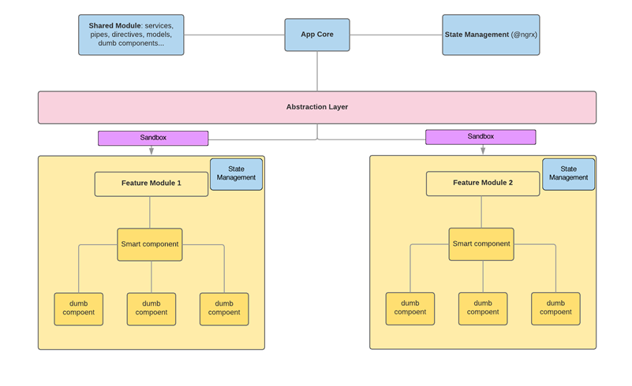

# High Level Architecture

- [High Level Architecture](#high-level-architecture)
  - [Modular design](#modular-design)
  - [Unidirectional data flow](#unidirectional-data-flow)
  - [Smart component (container component)](#smart-component-container-component)
  - [Dumb component (presentation component)](#dumb-component-presentation-component)
    - [Advantages of dumb components](#advantages-of-dumb-components)
  - [Predictable management of the state](#predictable-management-of-the-state)
    - [Immutability](#immutability)
    - [State types](#state-types)
  - [Communication layer for asynchronous requests](#communication-layer-for-asynchronous-requests)
    - [Presentation layer decoupled from the central layer](#presentation-layer-decoupled-from-the-central-layer)
  - [Links](#links)

## Modular design

Container modules easily coupled / uncoupled and defined by functionality. This also facilitates the testing and division of tasks between collaborators.

We will define different types of modules according to their objectives:

- **Main (root)**: the module that loads the application in all cases. It contains the main component as well as the routing of the root and the global state management.
- **Presentation**: they contain smart & dummy component, definition of routing and state management for defined functionality. They will be loaded by lazy loading.
- **Shared**: will be one or more than one, may contain services that must be imported into other modules, general configuration data,models, pipes, directives, helpers or reusable dummy components in other presentation modules.

## Unidirectional data flow

Components in angular are organized in the form of a hierarchical tree. The data flow between parent and child components will be unidirectional, meaning that these child components will accept parameters from their parent through `@Input` and will be able to send data through issuers through `@Output`.

## Smart component (container component)

The `smart` components are those that listen to the events of their children and pass data provided by the central layer of the application to these.
They listen to the status and data of the application, although they do not know anything about the way it is managed.

## Dumb component (presentation component)

These `dumb` components do not know anything about the status of the rest of the application.

- They are components that show a user interface and handle the interactions and changes in it by passing events to the container.
- They also do not redirect to other parts of the application.
- They do not have injected dependencies.
- They do not modify the data received directly.
- They should avoid including logic (only the one related to the same component) and state changes directly.
- Normally they will be reusable.

### Advantages of dumb components

- Small size.
- Easy to maintain
- Single Responsibility Principle (SRP).
- Easy to test
- They reduce the overall complexity of the application.

## Predictable management of the state

State refers to an object that contains the data structure of the application.  
As there are multiple sources of mutation in this state, we must ensure its predictability in order to avoid confusion and to produce different non-synchronized versions. In order to centralize this data we will use [`@ngrx store`](https://next.ngrx.io/).

### Immutability

Objects in javascript have values by reference (in memory). Therefore any change will be made through a pure function in which the reference of the object changes to a new one completely. The old object will go to the garbage collector. Mutation of data is difficult to debug and test, and the detection of changes in angular will not work predictably if the data is not immutable.  
More info at [What are mutable and immutable data structures?](https://benmccormick.org/2016/06/04/what-are-mutable-and-immutable-data-structures-2).

### State types

- **Persistent state**: it is a subset of the state provided by the server, stored in client. It must be reflected in the URL.
- **Client state**: this status is not stored on the server. For example, the filters used by the client to visualize a part of the persistent information. It must be reflected in the URL.
- **Transient client state**: this state is stored in the client, through LocalStorage, cookies ... although it is not represented in the URL.
- **UI Local state**: in charge of small aspects on the behavior or visualization of components, colors, elements visibility, etc.

> **The router must be the source of truth**. It must cause changes in the state of the application and not the other way around.

## Communication layer for asynchronous requests

Most actions that mutate the state of the application will be asynchronous: HTTP services or local storage (SQLite, LocalStorage ...).  
These actions should have error detection, interceptors, progress control, analysis of responses, etc.  
Therefore, it should be based on common responses based on the [DRY principle](https://en.wikipedia.org/wiki/Don%27t_repeat_yourself).

These services:

- will not know the state logic of the application in any case.
- will be decoupled from the presentation layer (components), logical as discussed in the section on components and the separation of tasks by modules.

The asynchronous services will be triggered by actions of the store, executed through the @Effects library of [`@ngrx store`](https://next.ngrx.io/).

### Presentation layer decoupled from the central layer

We should not inject in the dependency components, services or the store object.
Our modules should be concerned only with the presentation of data and not with the data logic.

The `smart` components are in contact with the state of the application but they do not manage it. They will have access to an abstraction layer that will behave like a [mediator / facade](https://en.wikipedia.org/wiki/Mediator_pattern) (called in our case `sandbox`), exposing an API, coordinating in this way the communication between multiple components of a module and the core of the application.

## Links

- [Angular architecture patterns – High level project architecture](https://netmedia.io/dev/angular-architecture-patterns-high-level-project-architecture_5589)
- [@ngrx store](https://next.ngrx.io/)
