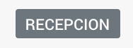

# Badge Component

- [Badge Component](#badge-component)
  - [Description](#description)
  - [HTML element](#html-element)
  - [Inputs](#inputs)
  - [Usage](#usage)
    - [Module](#module)
    - [Template](#template)
    - [Typescript](#typescript)

## Description

It's a simple text container with styling.



## HTML element

`<app-badge>`

## Inputs

| Name        | Type     | Description                                      |
| ----------- | -------- | ------------------------------------------------ |
| `name`      | `string` | sets badge text                                  |
| `className` | `string` | sets card classes names (separated by one space) |

## Usage

### Module

```javascript
// RECOMMENDED
import { SharedModule } from '@shared/shared.module';
// or
// import { BadgeModule } from '@shared/components/badge/badge.module';

@NgModule({
  imports: [
    SharedModule,
    // or
    // BadgeModule
  ]
})
export class AppModule(){}
```

### Template

```html
<!-- @Input: name && className -->
<app-badge [name]="name" [className]="className">
</app-badge>
```

### Typescript

```javascript
@Component({// ... })
export class CustomComponent {
  name = 'recepcion';
  className = 'badge-primary';
}
```
