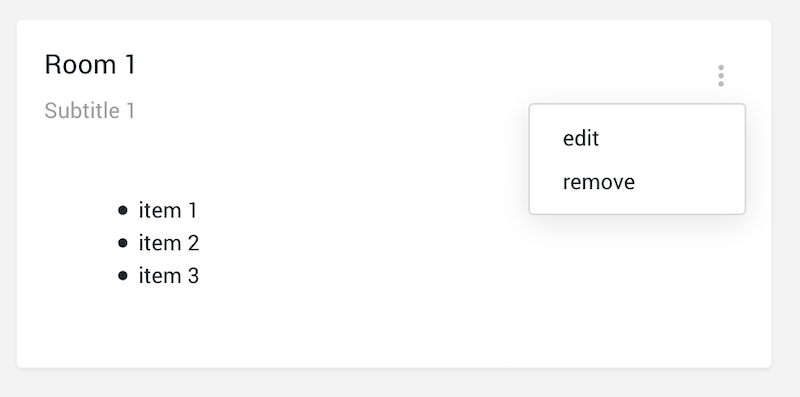

# Card Component

- [Card Component](#card-component)
  - [Description](#description)
  - [HTML element](#html-element)
  - [Content projection](#content-projection)
  - [Inputs](#inputs)
  - [Outputs](#outputs)
  - [Usage](#usage)
    - [Module](#module)
    - [Template](#template)
    - [Typescript](#typescript)

## Description

It's a content container for content and actions with header(s) in the context of a single subject.



## HTML element

`<app-card>`

## Content projection

| Selector   | Description        |
| ---------- | ------------------ |
| `title`    | sets card title    |
| `subtitle` | sets card subtitle |
| `body`     | sets body content  |

## Inputs

| Name      | Type            | Description                                                                                            |
| --------- | --------------- | ------------------------------------------------------------------------------------------------------ |
| `actions` | `Array<string>` | list of actions available to emit. Uses a [dropdown-menu component](dropdown-menu) to render the menu. |
  
## Outputs

| Name         | Type     | Description                           |
| ------------ | -------- | ------------------------------------- |
| `emitAction` | `string` | emits the selected action as a string |

## Usage

### Module

```javascript
// RECOMMENDED
import { SharedModule } from '@shared/shared.module';
// or
// import { CardModule } from '@shared/components/card/card.module';

@NgModule({
  imports: [
    SharedModule,
    // or
    // CardModule
  ]
})
export class AppModule(){}
```

### Template

```html
<!-- @Input: actions | @Output: emitAction -->
<app-card [actions]="actions" (emitAction)="triggerAction($event)">
  <!-- title content projection -->
  <span title>The title</span>
  <!-- subtitle content projection -->
  <span subtitle>The subtitle</span>
  <!-- body content projection -->
  <div body>
    <p>The body</p>
  </div>
</app-card>
```

### Typescript

```javascript
@Component({// ... })
export class CustomComponent {
  actions = ['action1', 'action2'];
  
  triggerAction(event: string) {
    // ...
  }
}
```
