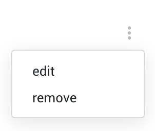

# Dropdown Menu Component

- [Dropdown Menu Component](#dropdown-menu-component)
  - [Description](#description)
  - [HTML element](#html-element)
  - [Inputs](#inputs)
  - [Outputs](#outputs)
  - [Usage](#usage)
    - [Module](#module)
    - [Template](#template)
    - [Typescript](#typescript)

## Description

It's a floating panel containing list of clickable options.



## HTML element

`<app-dropdown-menu>`

## Inputs

| Name      | Type            | Description                       |
| --------- | --------------- | --------------------------------- |
| `actions` | `Array<string>` | list of actions available to emit |
  
## Outputs

| Name         | Type     | Description                           |
| ------------ | -------- | ------------------------------------- |
| `emitAction` | `string` | emits the selected action as a string |

## Usage

### Module

```javascript
// RECOMMENDED
import { SharedModule } from '@shared/shared.module';
// or
// import { DropdownMenuModule } from '@shared/components/dropdown-menu/dropdown-menu.module';

@NgModule({
  imports: [
    SharedModule,
    // or
    // DropdownMenuModule
  ]
})
export class AppModule(){}
```

### Template

```html
<!-- @Input: actions | @Output: emitAction -->
<app-dropdown-menu
  [actions]="actions"
  (emitAction)="triggerAction($event)">
</app-dropdown-menu>
```

### Typescript

```javascript
@Component({// ... })
export class CustomComponent {
  actions = ['action1', 'action2'];
  
  triggerAction(event: string) {
    // ...
  }
}
```
