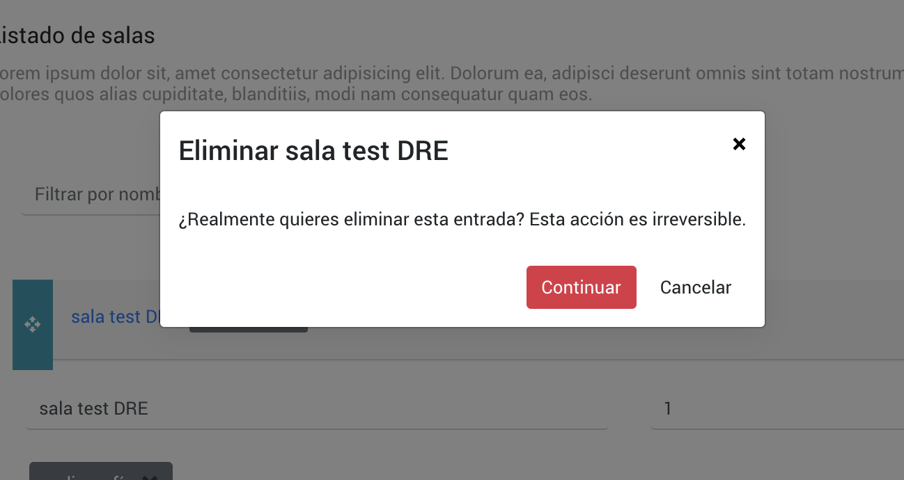

# Modal Components



## Modal Wrapper

Container modal

### Modal Wrapper HTML element

`<app-modal-wrapper>`

### Modal Wrapper Dependencies Injection

| Name             | Library         |
| ---------------- | --------------- |
| `BsModalService` | `ngx-bootstrap` |

### Modal Wrapper Inputs

| Name     | Type                                  | Description                                               |
| -------- | ------------------------------------- | --------------------------------------------------------- |
| `config` | `Observable<ConfirmationModalConfig>` | observable for object with all the configuration elements |

## Confirmation Modal Content

Configuration for the content of a modal

### Confirmation Modal Content HTML element

`<app-confirmation-modal-content>`

### Confirmation Modal Content Dependencies Injection

| Name         | Library         |
| ------------ | --------------- |
| `BsModalRef` | `ngx-bootstrap` |

### Confirmation Modal Content Inputs

| Name     | Type                      | Description                                |
| -------- | ------------------------- | ------------------------------------------ |
| `config` | `ConfirmationModalConfig` | object with all the configuration elements |

### Confirmation Modal Content Outputs

| Name         | Type   | Description                                                  |
| ------------ | ------ | ------------------------------------------------------------ |
| `emitClose`  | `void` | emits close modal                                            |
| `emitAction` | `any`  | emits the current config id associated with the config input |

### Usage

#### Modules

```javascript
// RECOMMENDED
import { SharedModule } from '@shared/shared.module';
// or
// import { ModalWrapperModule } from '@shared/components/modal-wrapper/modal-wrapper.module';
// import { ConfirmationModalContentModule } from '@shared/components/confirmation-modal-content/confirmation-modal-content.module';

@NgModule({
  imports: [
    SharedModule,
    // or
    // ModalWrapperModule
    // ConfirmationModalContentModule
  ]
})
export class AppModule(){}
```

#### Template

```html
<app-modal-wrapper [config$]="config$">
  <app-confirmation-modal-content
    *ngIf="config$ | async as config"
    [config]="config"
    (emitClose)="closeModal()"
    (emitAction)="config.action($event)"
  ></app-confirmation-modal-content>
</app-modal-wrapper>
```

#### Modal Wrapper Typescript

```javascript
@Component({// ... }) 
export class ModalWrapperComponent implements OnInit, OnDestroy {
  @ViewChild('template', { static: true }) template: ModalDirective;
  @Input() config$: Observable<ConfirmationModalConfig>;
  configSubscription: Subscription;

  constructor(private modalService: BsModalService) {}

  ngOnInit() {
    this.configSubscription = this.config$.subscribe(config => {
      if (!!config && config.visible) {
        this.modalService.show(this.template);
      } else {
        this.modalService.hide(1);
      }
    });
  }

  ngOnDestroy() {
    this.destroySubscriptions();
  }

  destroySubscriptions() {
    if (this.configSubscription) {
      this.configSubscription.unsubscribe();
    }
  }
}
```

#### Confirmation Modal Content Typescript

```javascript
@Component({// ... })
export class ConfirmationModalContentComponent {
  @Input() config: ConfirmationModalConfig;
  @Output() emitClose: EventEmitter<void> = new EventEmitter();
  @Output() emitAction: EventEmitter<any> = new EventEmitter();

  constructor(public bsModalRef: BsModalRef) {}

  doAction() {
    this.emitAction.emit(this.config.id);
  }

  closeModal() {
    this.emitClose.emit();
  }
}
```

## Related Types

```javascript
export interface ConfirmationModalConfig {
  visible: boolean; // sets visibility of modal
  title: string; // main title of modal
  body?: string; // content of modal
  data?: object; // related action item data
  action?(id?: string | number): void; // YES action to execute
}
```

## Links

- [NGXBootstrap Modal](https://valor-software.com/ngx-bootstrap/#/modals)
